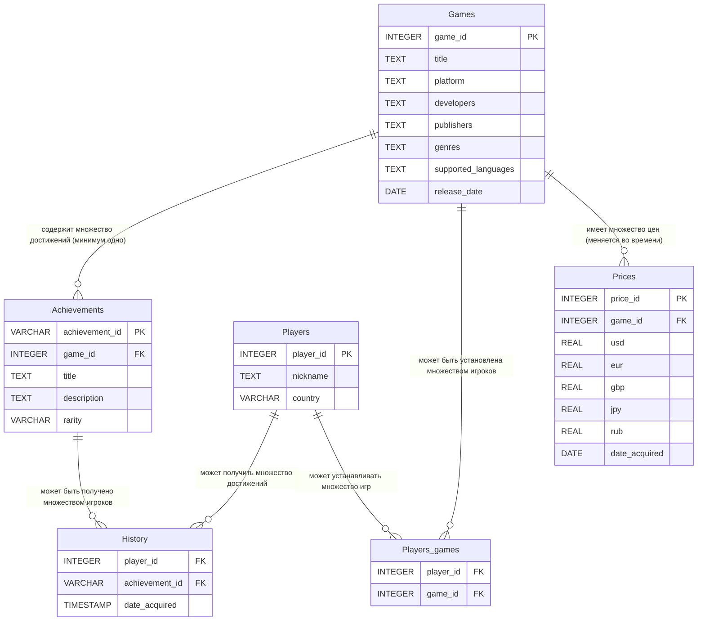

# 1 Учебный BI‑проект в Apache Superset

Дашборд для отслеживания трендов на рынке игр на основе данных о ценах, установках и достижениях игроков.

## Ссылка на дашборд

Учебный сервер Superset:  
https://superset.bi-analysts.education-services.ru/

> Дашборд доступен только под учебной учетной записью.

## Описание кейса

Дашбордом будут пользоваться:

- топ‑менеджеры — для оценки потенциала новых релизов и корректировки ценовой политики;
- аналитики — для анализа эффективности отдельных игр и выявления точек роста.

Для отчёта собраны следующие данные:

- **Prices** — история изменения цен на игры в разных валютах (USD, EUR, GBP, JPY, RUB) с привязкой к дате и идентификатору игры.
- **Games** — справочник игр с информацией о названии, платформе, разработчиках, издателях, жанрах, поддерживаемых языках и дате релиза.
- **Players** — данные об игроках (идентификатор, никнейм, страна).
- **Players_games** — связь между игроками и установленными ими играми (факт установки каждой игры конкретным игроком).
- **Achievements** — информация о достижениях в играх (название, описание, редкость, принадлежность к игре).
- **History** — история получения достижений игроками с датой и временем (активность игроков внутри игр).

Период данных: **2007–2025** годы.

Собранные данные структурированы в тематические таблицы и интегрированы в хранилище с настроенным обновлением.  
Следующий шаг — связать эти данные между собой и создать дашборд, который позволяет отслеживать ключевые метрики игрового рынка: динамику цен, пользовательский интерес (установки и достижения) и вовлеченность игроков.

## Структура данных

Используемые таблицы содержат информацию для аналитики игр и поведения игроков.

### Таблица `Prices`

- `game_id` — INTEGER  
- `usd` — REAL  
- `eur` — REAL  
- `gbp` — REAL  
- `jpy` — REAL  
- `rub` — REAL  
- `date_acquired` — DATE  
- `price_id` — INTEGER  

### Таблица `Games`

- `game_id` — INTEGER  
- `title` — TEXT  
- `platform` — TEXT  
- `developers` — TEXT  
- `publishers` — TEXT  
- `genres` — TEXT  
- `supported_languages` — TEXT  
- `release_date` — DATE  

### Таблица `Players`

- `player_id` — INTEGER  
- `nickname` — TEXT  
- `country` — VARCHAR  

### Таблица `Players_games`

- `player_id` — INTEGER  
- `game_id` — INTEGER  

### Таблица `Achievements`

- `achievement_id` — VARCHAR  
- `game_id` — INTEGER  
- `title` — TEXT  
- `description` — TEXT  
- `rarity` — VARCHAR  

### Таблица `History`

- `player_id` — INTEGER  
- `achievement_id` — VARCHAR  
- `date_acquired` — TIMESTAMP  

## ER‑диаграмма (Mermaid)

## Комментарии к ER‑диаграмме

- **Games ↔ Prices (один‑ко‑многим)**  
  Одна игра имеет множество записей в `Prices` (цена меняется во времени).  
  Каждая запись цены относится к одной игре (`game_id` как FK).

- **Players ↔ Games через `Players_games` (многие‑ко‑многим)**  
  Игрок может установить много игр, игра может быть установлена многими игроками.  
  Прямая связь отсутствует — только через связующую таблицу.

- **Games ↔ Achievements (один‑ко‑многим)**  
  Одна игра содержит множество достижений.  
  Семантически предполагается минимум одно достижение на игру.

- **Players ↔ Achievements через `History` (многие‑ко‑многим)**  
  Игрок может получить много достижений; достижение может быть получено многими игроками.  
  Таблица `History` фиксирует факт и время получения.

- **Отсутствующие связи (намеренно)**  
  Нет прямой связи `Players → Games` (только через `Players_games`).  
  Нет связи `Prices → Players` (цены не зависят от конкретного игрока).  
  `Players_games` не содержит данных о достижениях (это зона ответственности `History`).

## Мой вклад в проект

- Проектирование схемы данных для аналитики игрового рынка.  
- Разработка ER‑диаграммы и уточнение семантики связей.  
- Настройка витрин и построение дашборда в Apache Superset для отслеживания ключевых метрик.
